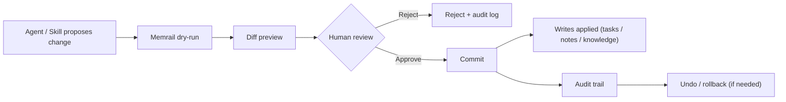

# Memrail

[](LICENSE)
[](https://github.com/zhuamber370/memrail/issues)
[](https://github.com/zhuamber370/memrail/commits/main)

Memrail is **OpenClaw's governed memory + task infrastructure**.

It adds a PR-like control loop in front of agent writes:
**dry-run -> diff preview -> human approve/reject -> commit -> audit (+ undo)**.

Quick links:
- Try locally in 60 seconds: [Dry-Run Demo](#60-second-dry-run-demo)
- Run full stack: [Quickstart (Local)](#quickstart-local)
- Integrate with OpenClaw: [INTEGRATION.md](INTEGRATION.md)
- Runtime/API contract: [docs/guides/agent-api-surface.md](docs/guides/agent-api-surface.md)

## Why Memrail

OpenClaw-heavy workflows often break when:
- agent writes silently pollute memory and docs
- changes are hard to review, trace, and roll back
- tasks, knowledge, and execution context drift across tools

Memrail keeps workflows **governed, traceable, and reversible**.

## Who It Is For

- Teams or solo builders using OpenClaw where memory quality matters
- Workflows that require human approval for write operations
- Anyone who needs change audit trail and rollback for agent-generated updates

## Who It Is Not For

- Fully autonomous write pipelines with no human review gate
- Teams looking for SaaS multi-tenant billing/OAuth out of the box

## What You Get

- **Governed write pipeline**: all writes go through dry-run and human review
- **Human review inbox**: `/changes` for diff-based commit/reject decisions
- **Operational workspace**: `/tasks` + `/knowledge` for day-to-day execution
- **Rollback safety**: undo the last commit when needed

## Governance Flow (PR-like changes)



## 60-Second Dry-Run Demo

### 0) Prereq

Start backend + frontend first (see [Quickstart (Local)](#quickstart-local)). Then verify backend health:

```bash
curl -sS http://127.0.0.1:8000/health
```

### 1) Create a proposal (dry-run)

```bash
curl -sS -X POST http://127.0.0.1:8000/api/v1/changes/dry-run \
  -H "Content-Type: application/json" \
  -d '{
    "tool": "cli",
    "actor": { "type": "user", "id": "local" },
    "actions": [
      {
        "type": "create_knowledge",
        "payload": {
          "title": "Memrail dry-run demo",
          "body": "Hello from dry-run. This is only written after commit.",
          "category": "mechanism_spec"
        }
      }
    ]
  }'
```

Expected: response includes `change_set_id`, `summary`, and `diff_items`.

### 2) Commit only after human approval

```bash
CHG_ID="chg_..."  # replace with returned change_set_id

curl -sS -X POST "http://127.0.0.1:8000/api/v1/changes/${CHG_ID}/commit" \
  -H "Content-Type: application/json" \
  -d '{
    "approved_by": { "type": "user", "id": "local" },
    "client_request_id": "readme-dryrun-quickstart"
  }'
```

If you do not approve, reject it in `/changes` (or just do not commit).

## UI Preview

> Screenshots use synthetic test data.


## Quickstart (Local)

### 1) Clone

```bash
git clone https://github.com/zhuamber370/memrail.git
cd memrail
```

### 2) Configure env

```bash
cp .env.example .env
cp .env frontend/.env.local
```

Default local mode:
- `AFKMS_DB_BACKEND=sqlite`
- `AFKMS_REQUIRE_AUTH=false`

### 3) Run backend

```bash
cd backend
python3 -m venv .venv
source .venv/bin/activate
pip install -r requirements.txt
python3 -m uvicorn src.app:app --reload --port 8000
```

### 4) Run frontend

```bash
cd frontend
npm install
npm run dev
```

### 5) Verify

- Backend: <http://127.0.0.1:8000/health>
- Frontend: <http://127.0.0.1:3000>

For PostgreSQL setup and deeper runtime options, see:
- [backend/README.md](backend/README.md)
- [frontend/README.md](frontend/README.md)

## OpenClaw Integration

Install workspace skill:

```bash
bash scripts/install_openclaw_kms_skill.sh
openclaw skills info kms --json
openclaw skills check --json
```

Integration references:
- OpenClaw-first integration guide: [INTEGRATION.md](INTEGRATION.md)
- Skill contract: [openclaw-skill/kms/SKILL.md](openclaw-skill/kms/SKILL.md)

## Docs and Proof

- Full docs index: [docs/README.md](docs/README.md)
- Runtime/API contract: [docs/guides/agent-api-surface.md](docs/guides/agent-api-surface.md)
- Proof pack: [docs/proof/README.md](docs/proof/README.md)

## Contributing

- Start guide: [CONTRIBUTING.md](CONTRIBUTING.md)
- Contributor dev setup: [docs/contributing/dev-setup.md](docs/contributing/dev-setup.md)
- Good first issues: <https://github.com/zhuamber370/memrail/issues?q=is%3Aissue+is%3Aopen+label%3A%22good+first+issue%22>

## Security

Please follow [SECURITY.md](SECURITY.md) for responsible disclosure.

## License

Apache-2.0. See [LICENSE](LICENSE).
