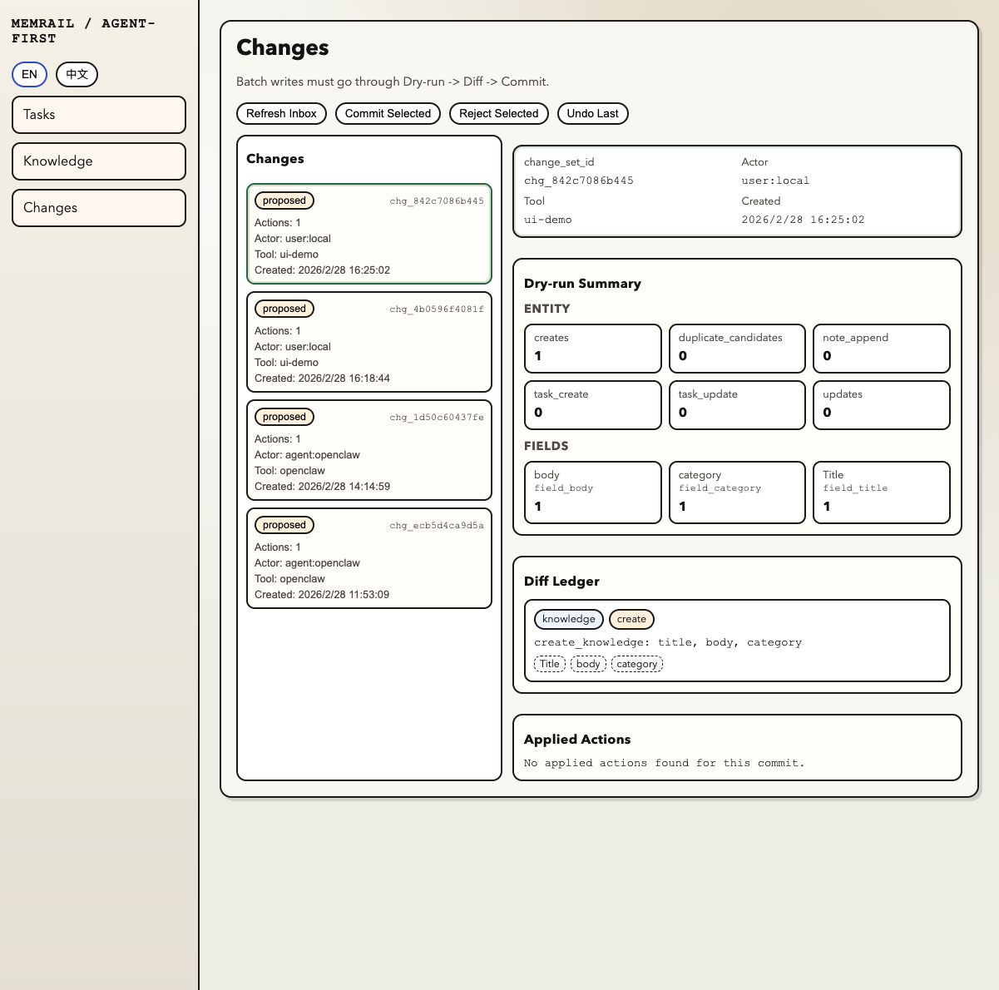
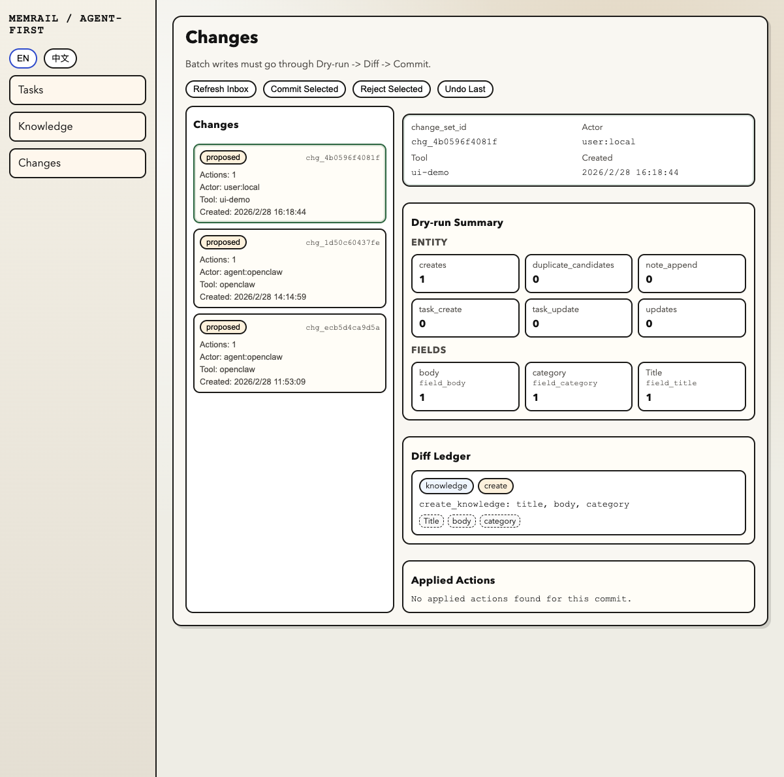

# Memrail

Memrail is **OpenClaw’s governed memory & change-governance infrastructure** — a PR-like review layer for agent writes.

Every write becomes a proposal: **dry-run → diff preview → human approve/reject → commit**, with full **audit trail** and **undo**.

## Why it exists
OpenClaw-heavy workflows break when:
- agent writes pollute memory / docs
- changes are hard to review and roll back
- tasks, knowledge, and execution drift across tools

Memrail keeps your workflow **executable, governed, and traceable**.

## What you get
- Governed write pipeline: dry-run → commit/reject → undo-last
- One-screen workspace: /tasks + /knowledge + /changes
- Audit trail for every proposal and commit

## Governance Flow (PR-like changes)

```mermaid
flowchart LR
A[Agent / Skill proposes change] --> B[Memrail dry-run]
B --> C[Diff preview]
C --> D{Human review}
D -- Reject --> E[Reject + audit log]
D -- Approve --> F[Commit]
F --> G[Writes applied (tasks / notes / knowledge)]
F --> H[Audit trail]
H --> I[Undo / rollback (if needed)]
```

## Dry-run quickstart (diff preview)

This is the core loop: **dry-run → diff preview → (human) approve → commit**.

### 0) Prereq
Start backend + frontend (see **Quickstart** below). Then verify:

```bash
curl -sS http://127.0.0.1:8000/health
```

### 1) Create a proposal (dry-run) — get diff preview

```bash
curl -sS -X POST http://127.0.0.1:8000/api/v1/changes/dry-run \
  -H "Content-Type: application/json" \
  -d '{
    "tool": "cli",
    "actor": { "type": "user", "id": "local" },
    "actions": [
      {
        "type": "create_knowledge",
        "payload": {
          "title": "Memrail dry-run demo",
          "body": "Hello from dry-run. This will only be written after commit.",
          "category": "mechanism_spec"
        }
      }
    ]
  }'
```

**Expected output (example)**

```json
{
  "change_set_id": "chg_...",
  "status": "proposed",
  "summary": { "knowledge_create": 1, "creates": 1, "updates": 0 },
  "diff_items": [
    {
      "entity": "knowledge",
      "action": "create",
      "fields": ["title", "body", "category"],
      "text": "create_knowledge: title, body, category"
    }
  ]
}
```

> To reject: simply do not commit this `change_set_id` (or reject it in `/changes` UI).

### 2) Commit the proposal (human approval)

Replace `CHG_ID` with the `change_set_id` returned above:

```bash
CHG_ID="chg_..."  # <-- replace me

curl -sS -X POST "http://127.0.0.1:8000/api/v1/changes/${CHG_ID}/commit" \
  -H "Content-Type: application/json" \
  -d '{
    "approved_by": { "type": "user", "id": "local" },
    "client_request_id": "readme-dryrun-quickstart"
  }'
```

**Expected output (example)**

```json
{
  "commit_id": "cmt_...",
  "change_set_id": "chg_...",
  "status": "committed",
  "committed_at": "..."
}
```

## UI demo (Changes inbox)

1) Create a proposal (dry-run)
2) Review diff in `/changes`
3) Human approves and commits





## Proof pack (verifiable artifacts)

- `docs/proof/dry-run-response.json` (proposal + diff)
- `docs/proof/commit-response.json` (commit result)
- `docs/proof/audit-events-proof.json` (audit trail)
- `docs/proof/incident-human-reject.md` (rejection scenario)

## Start here
- **Try it locally**: see **Quickstart** below
- **Use with OpenClaw**: install the `kms` skill (see **OpenClaw Skill** below)
- **Integrate (OpenClaw-first)**: see `INTEGRATION.md` and open an **Integration Request** issue (label: `integration`)
- **New contributors**: start with <https://github.com/zhuamber370/memrail/issues?q=is%3Aissue+is%3Aopen+label%3A%22good+first+issue%22>

## Screenshots
> Screenshots use **synthetic test data**.

**Tasks dashboard**


**Knowledge workspace**


## Current Scope (Synced 2026-02-27)

### 1. Governed write pipeline
- `dry-run -> commit/reject -> undo-last`
- Batch-level diff, summary, and audit trace for write operations.

### 2. Agent-readable data surface
Backend exposes read APIs for:
- `tasks`, `topics`, `cycles`
- `notes`, `knowledge`, `links`, `inbox`
- `journals` (+ journal items)
- `ideas`, `routes` (+ graph and node logs)
- `changes`, `audit`, `context`

### 3. Task Command Center (desktop-first)
- `/tasks` is the main execution workspace.
- Search/filter/list/detail in one screen.
- Execution canvas (route graph) supports node/edge operations and relation labels.

### 4. Knowledge workspace
- `/knowledge` is a focused knowledge CRUD console.
- Current categories:
  - `ops_manual`
  - `mechanism_spec`
  - `decision_record`
- Status lifecycle: `active | archived`.

### 5. Change review inbox
- `/changes` is the human review surface for agent proposals.
- Supports commit/reject and undo of last commit.

## Tech Stack
- Backend: FastAPI + SQLAlchemy
- Frontend: Next.js 14
- Default DB: SQLite
- Optional DB: PostgreSQL

## Prerequisites
- Python 3.10+
- Node.js 18+

## Quickstart

### 1) Clone

```bash
git clone https://github.com/zhuamber370/memrail.git
cd memrail
```

### 2) Configure env

```bash
cp .env.example .env
cp .env frontend/.env.local
```

Notes:
- Backend reads `backend/.env` and root `.env`.
- Frontend reads `frontend/.env.local`.
- Default local mode:
  - `AFKMS_DB_BACKEND=sqlite`
  - `AFKMS_REQUIRE_AUTH=false`

### 3) Run backend

```bash
cd backend
python3 -m venv .venv
source .venv/bin/activate
pip install -r requirements.txt
python3 -m uvicorn src.app:app --reload --port 8000
```

### 4) Run frontend

```bash
cd frontend
npm install
npm run dev
```

### 5) Verify
- Backend: [http://127.0.0.1:8000/health](http://127.0.0.1:8000/health)
- Frontend: [http://127.0.0.1:3000](http://127.0.0.1:3000)

## Optional: PostgreSQL

Set in `.env`:
- `AFKMS_DB_BACKEND=postgres`
- `AFKMS_DB_HOST`
- `AFKMS_DB_PORT`
- `AFKMS_DB_NAME`
- `AFKMS_DB_USER`
- `AFKMS_DB_PASSWORD`

Bootstrap:

```bash
cd backend
source .venv/bin/activate
python3 scripts/bootstrap_postgres.py
```

## OpenClaw Skill

Install workspace skill:

```bash
bash scripts/install_openclaw_kms_skill.sh
```

Check:

```bash
openclaw skills info kms --json
openclaw skills check --json
```

### How to ask (OpenClaw kms skill)

Memrail ships with an OpenClaw skill (`kms`) that routes **natural-language requests** to governed reads/writes.

- **Reads are safe by default**.
- **Writes require explicit intent** and follow: **dry-run → confirm → commit**.

**Read (no writes)**
- "What is the current progress of task 'Agent-first SaaS'? What's the current node and its status?"
- "Show me the route graph for task 'Agent-first SaaS' and the next steps on the critical path."
- "List the most recently updated knowledge items (active)."
- "Search knowledge for 'governed proposals' and summarize the top 3 results."

**Write (will propose a change first)**
- "Record this TODO in Memrail: 'Add README how-to-ask examples', priority P1, topic 'Memrail'."
- "Create a knowledge note (decision_record): title 'Memrail positioning v0', body: ..."
- "Create a route under task 'Agent-first SaaS': Start → Plan → Implement → Review → Done."

**Confirm / reject / undo**
- "Confirm and commit the proposal."
- "Reject the proposal."
- "Undo the last commit."

(Details: `openclaw-skill/kms/SKILL.md`)

## Contributing

Contributions are welcome! See `CONTRIBUTING.md` and `docs/contributing/dev-setup.md`.

Start here:
- Good first issues: <https://github.com/zhuamber370/memrail/issues?q=is%3Aissue+is%3Aopen+label%3A%22good+first+issue%22>

If you want to contribute but are unsure where to start, open an issue (or comment on an existing one) and maintainers can point you to a small, high-signal first change.

### How to file a good issue (examples)

Good issues help maintainers reproduce quickly and help contributors pick up work.

**Bug report**
- What happened: "When I click **Commit**, the page returns 500 and the proposal stays in Pending."
- Steps to reproduce:
  1. Start backend + frontend locally
  2. Create a proposal via `/changes` (dry-run)
  3. Click **Commit**
- Expected: "Commit succeeds and proposal is marked as committed."
- Environment: OS, browser, repo commit SHA
- Attachments: logs and screenshots (use synthetic test data)

**Feature request**
- Problem: "Reviewing large diffs in `/changes` is hard to scan."
- Proposal: "Add a collapsed view + expand per item."
- Acceptance criteria: "With 50+ lines, I can expand/collapse sections and still commit/reject safely."

## Documentation Map

Authoritative runtime docs:
- `README.md`
- `backend/README.md`
- `frontend/README.md`
- `openclaw-skill/kms/SKILL.md`
- `docs/guides/agent-api-surface.md`
- `docs/reports/mvp-release-notes.md`
- `docs/reports/mvp-e2e-checklist.md`

Historical design/planning docs live under `docs/plans/` and are not treated as runtime contracts.

## Security

For security disclosures, follow `SECURITY.md`.

## License

Apache-2.0. See `LICENSE`.
