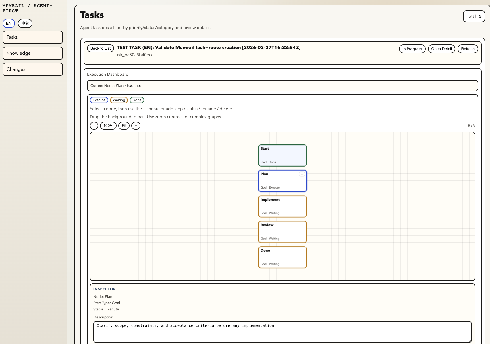
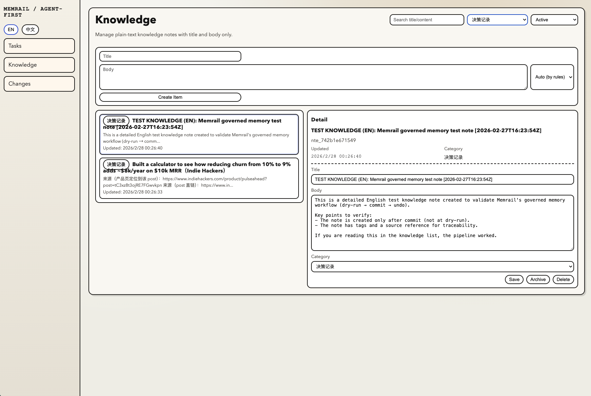

# Memrail

Memrail is the task + knowledge command center for OpenClaw workflows — where agent proposals are governed by human review (with audit + undo).

## Why it exists
OpenClaw-heavy workflows break when:
- agent writes pollute memory / docs
- changes are hard to review and roll back
- tasks, knowledge, and execution drift across tools

Memrail keeps your workflow **executable, governed, and traceable**.

## What you get
- Governed write pipeline: dry-run → commit/reject → undo-last
- One-screen workspace: /tasks + /knowledge + /changes
- Audit trail for every proposal and commit

## Screenshots
> Screenshots use **synthetic test data**.

**Tasks dashboard**



**Knowledge workspace**



## Current Scope (Synced 2026-02-27)

### 1. Governed write pipeline
- `dry-run -> commit/reject -> undo-last`
- Batch-level diff, summary, and audit trace for write operations.

### 2. Agent-readable data surface
Backend exposes read APIs for:
- `tasks`, `topics`, `cycles`
- `notes`, `knowledge`, `links`, `inbox`
- `journals` (+ journal items)
- `ideas`, `routes` (+ graph and node logs)
- `changes`, `audit`, `context`

### 3. Task Command Center (desktop-first)
- `/tasks` is the main execution workspace.
- Search/filter/list/detail in one screen.
- Execution canvas (route graph) supports node/edge operations and relation labels.

### 4. Knowledge workspace
- `/knowledge` is a focused knowledge CRUD console.
- Current categories:
  - `ops_manual`
  - `mechanism_spec`
  - `decision_record`
- Status lifecycle: `active | archived`.

### 5. Change review inbox
- `/changes` is the human review surface for agent proposals.
- Supports commit/reject and undo of last commit.

## Tech Stack
- Backend: FastAPI + SQLAlchemy
- Frontend: Next.js 14
- Default DB: SQLite
- Optional DB: PostgreSQL

## Prerequisites
- Python 3.10+
- Node.js 18+

## Quickstart

### 1) Clone

```bash
git clone https://github.com/zhuamber370/memrail.git
cd memrail
```

### 2) Configure env

```bash
cp .env.example .env
cp .env frontend/.env.local
```

Notes:
- Backend reads `backend/.env` and root `.env`.
- Frontend reads `frontend/.env.local`.
- Default local mode:
  - `AFKMS_DB_BACKEND=sqlite`
  - `AFKMS_REQUIRE_AUTH=false`

### 3) Run backend

```bash
cd backend
python3 -m venv .venv
source .venv/bin/activate
pip install -r requirements.txt
python3 -m uvicorn src.app:app --reload --port 8000
```

### 4) Run frontend

```bash
cd frontend
npm install
npm run dev
```

### 5) Verify
- Backend: [http://127.0.0.1:8000/health](http://127.0.0.1:8000/health)
- Frontend: [http://127.0.0.1:3000](http://127.0.0.1:3000)

## Optional: PostgreSQL

Set in `.env`:
- `AFKMS_DB_BACKEND=postgres`
- `AFKMS_DB_HOST`
- `AFKMS_DB_PORT`
- `AFKMS_DB_NAME`
- `AFKMS_DB_USER`
- `AFKMS_DB_PASSWORD`

Bootstrap:

```bash
cd backend
source .venv/bin/activate
python3 scripts/bootstrap_postgres.py
```

## OpenClaw Skill

Install workspace skill:

```bash
bash scripts/install_openclaw_kms_skill.sh
```

Check:

```bash
openclaw skills info kms --json
openclaw skills check --json
```

### How to ask (examples)

The `kms` skill routes **natural-language requests** to Memrail reads/writes.

- **Reads are safe by default**.
- **Writes require an explicit write intent**, and follow: **dry-run → confirm → commit**.

#### Read examples (no writes)

- "What is the current progress of task 'Agent-first SaaS'? What's the current node and its status?"
- "Show me the route graph for task 'Agent-first SaaS' and the next steps on the critical path."
- "List the most recently updated knowledge items (active)."
- "Search knowledge for 'governed proposals' and summarize the top 3 results."

#### Write examples (will propose a change first)

- "Record this TODO in Memrail: 'Add README how-to-ask examples', priority P1, topic 'Memrail'."
- "Create a knowledge note (decision_record): title 'Memrail positioning v0', body: ..."
- "Create a route under task 'Agent-first SaaS': Start → Plan → Implement → Review → Done."

#### Confirm / reject / undo

- "Confirm and commit the proposal."
- "Reject the proposal." 
- "Undo the last commit."

## Contributing

Contributions are welcome! See `CONTRIBUTING.md` and `docs/contributing/dev-setup.md`.

If you want to contribute but are unsure where to start, open an issue (or comment on an existing one) and maintainers can point you to a small, high-signal first change.

## Documentation Map

Authoritative runtime docs:
- `README.md`
- `backend/README.md`
- `frontend/README.md`
- `openclaw-skill/kms/SKILL.md`
- `docs/guides/agent-api-surface.md`
- `docs/reports/mvp-release-notes.md`
- `docs/reports/mvp-e2e-checklist.md`

Historical design/planning docs live under `docs/plans/` and are not treated as runtime contracts.

## Security

For security disclosures, follow `SECURITY.md`.

## License

Apache-2.0. See `LICENSE`.
